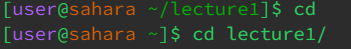
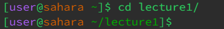
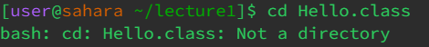

# Lab Report 1

## Testing out cd

Since I was in a directory already, lecture1, with no argument inputed it would take me back to the orignal directory.

A directory input will take me into the directory

Since I inputted a class file, it is not a directory so the terminal will produce an error.

