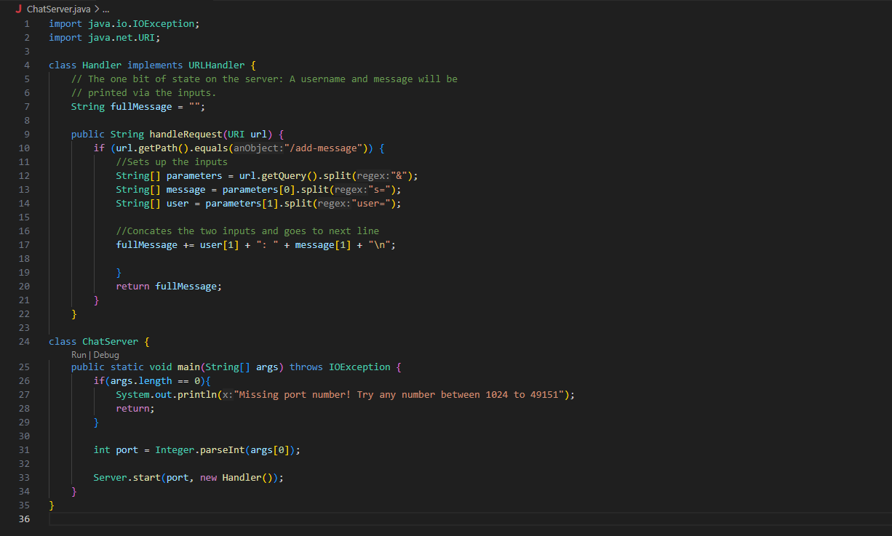
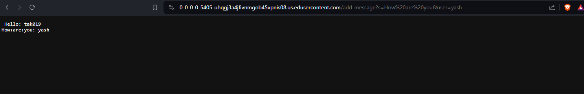

# Lab Report 2

Code for ChatServer.java:

---

Examples for `/add-messages`

- The `handleRequest` method is being called
- The arguments here are `user` and `message` and when the URL receives the input from `/add-message/` it updates the field, `fullMessage`, combining them
- The parameters `user` and `message` can keep changing depending on what the user inputs into the URL which in turn will update `fullMessage`
---

- The `handleRequest` method is being called
- The arguments here are `user` and `message` and when the URL receives the input from `/add-message/` it updates the field, `fullMessage`, combining them
- The parameter `message` includes spaces within it now so the output will replace the spaces with the symbol, %, because URLs cannot have spaces. The `user` parameter works the same as the first example.
---
