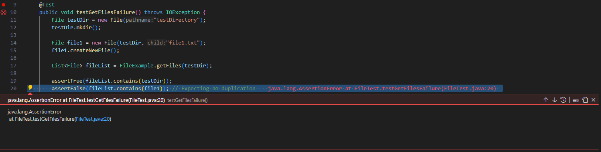
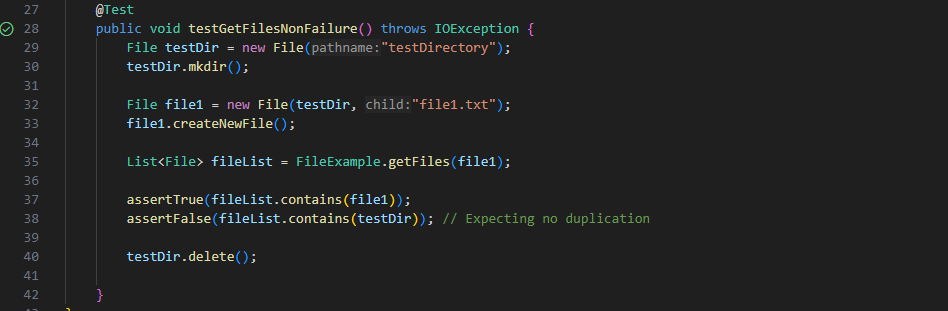

# Lab Report 3

## Part 1
Failure-inducing input:
```
    @Test
    public void testGetFilesFailure() throws IOException {
        File testDir = new File("testDirectory");
        testDir.mkdir();
        
        File file1 = new File(testDir, "file1.txt");
        file1.createNewFile();
        
        List<File> fileList = FileUtil.getFiles(testDir);
        
        assertTrue(fileList.contains(testDir));
        assertFalse(fileList.contains(file1)); // Expecting no duplication
        
        testDir.delete();
```
---
Non-failure-inducing input:
```
    @Test
    public void testGetFilesNonFailure() throws IOException {
        File testDir = new File("testDirectory");
        testDir.mkdir();
        
        File file1 = new File(testDir, "file1.txt");
        file1.createNewFile();
        
        List<File> fileList = FileUtil.getFiles(file1);
        
        assertTrue(fileList.contains(file1));
        assertFalse(fileList.contains(testDir)); // Expecting no duplication
        
        testDir.delete();
    }

```
---
Fail Output:

---
Success Ouput:

---
Before:
```
	static List<File> getFiles(File start) throws IOException {
	  File f = start;
	  List<File> result = new ArrayList<>();
	  result.add(start);
	  if(f.isDirectory()) {
	    File[] paths = f.listFiles();
	    for(File subFile: paths) {
	      result.add(subFile);
	    }
	  }
	  return result;
	}
}
```
---
After:
```
static List<File> getFiles(File start) throws IOException {
    List<File> result = new ArrayList<>();
    if(start.isDirectory()) {
        File[] paths = start.listFiles();
        for(File subFile: paths) {
            result.add(subFile);
        }
    }
    return result;
}
```
---
Explanation: The bug within the method 'getFiles' is that it adds the `start` file to the result list before checking whether or not it's a directory. This causes the start file to be duplicated into the result list whenever `start` is a directory. In the fixed code, the `start` file is now only added to the result list if it's a directory, preventing duplication of the start file into the result list when processing directories.
---
## Part 2
Using -type
```
C:\Users\XChip\OneDrive\Documents\GitHub\docsearch>find ./technical -type d
./technical
./technical/911report
./technical/biomed
./technical/government
./technical/government/About_LSC
./technical/government/Alcohol_Problems  
./technical/government/Env_Prot_Agen     
./technical/government/Gen_Account_Office
./technical/government/Media
./technical/government/Post_Rate_Comm    
./technical/plos
```
This command finds and lists only directories within the ./technical directory. It's useful when you want to specifically target directories for further processing or inspection.

```
C:\Users\XChip\OneDrive\Documents\GitHub\docsearch>find ./technical -type d -name "911report*"    
./technical/911report
```
This command combines `-type d` with `-name` to find directories with names matching the pattern within the directory. It's handy for narrowing down directory searches based on specific naming patterns.


