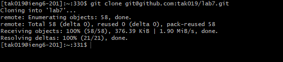
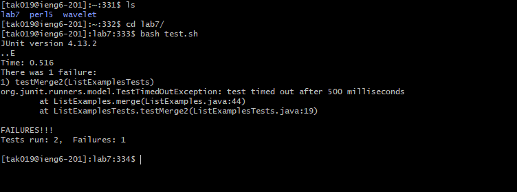

# Lab Report 4

## Step 4
Keys pressed: `ssh tak019@ieng6.ucsd.edu <enter>`

Typing ssh allows me to login into ieng6 with my account `tak019`

## Step 5
Keys pressed: `git clone git@github.com:tak019/lab7.git <enter>`

Git clone allows me to clone the lab7 repository using its SSH URL
 

## Step 6
Keys pressed: `bash test.sh <enter>`

Using bash I can run the tester file to check if there are any failures.

## Step 7 
Keys pressed: `vim ListExamples.java <enter>` then, `43j e l i <backspace> "2" esc :wq <enter>`
