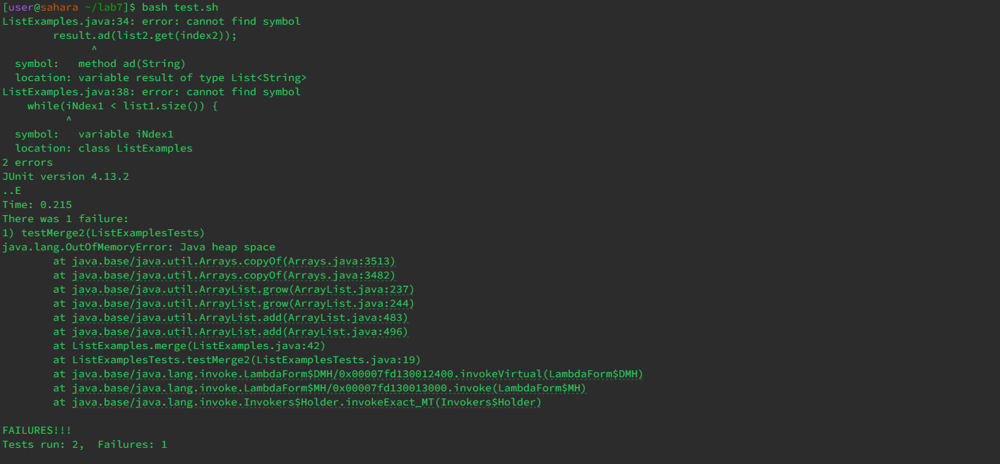
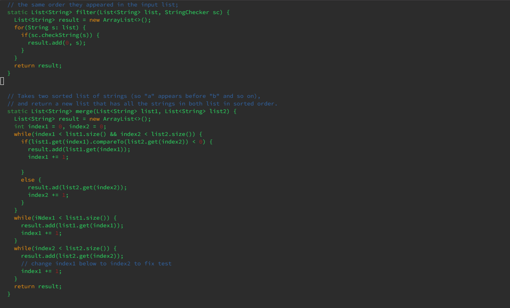
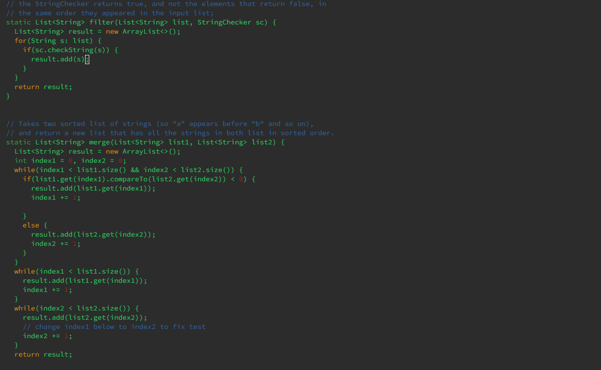
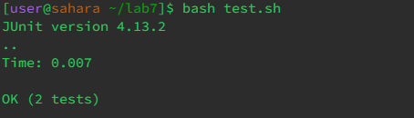

Part 1
# Edstem

## Can't get testers to work

Tam Kim
---

Hello, I am currently trying to use `bash` to test `ListExamples.java`, however, I keep running into these error messages and I am unsure of what it is trying to ask me.

---
1 Answer

 TA

Hi Tam,

Would you provide me with your code so I can take a look at it?

---
Tam Kim

Oh sorry here is my code

 TA

Hi Tam, 

It seems that the error you are coming across relates to your grammar and logic within the code. I would advise you to double-check and make sure that all your words are written correctly. Also you should take a look at your first `result.add`. 
Hope this helps!

---

I just looked back and fixed the spelling and grammatical errors within my `ListExamplesTest.java` file and the indexing with my `result.add` function. Thank you so much!

---
Part 2
Reflection:
Throughout this quarter, I have gained a lot of knowledge and skills from labs and lecture. For example, before this I had never touched `vim`, let alone `bash` before and because of the labs, I feel that I have gained a good understanding of how to use them.
