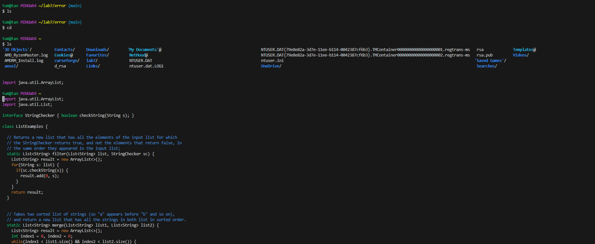

# Edstem

## Can't vim into ListExamples

Tam Kim
---
Hello, I am currently trying to use vim on ListExamples.java, however every time I try to vim, it produces a blank document with no code on it.

---

 TA

Hi Tam, 

It seems that the error that you are coming across is due to being in the wrong directory, try to `cd` out of `error` and then try to vim from there.

Hope this helps!
---

